Taken from saveminecraft.org/leaks, without imgur images
# Internal Mojang Leaks

An anonymous leak that the #saveminecraft community has found provides significant evidence that suggests Mojang purposely kept the community in the dark, decided to be purposely ignorant on the highest communication levels, and it shows how far bad actors will go to get what they want.

On June 15, 2022, Mojang released snapshot 22w24a with the new chat reporting feature for Minecraft: Java Edition. Instantly, a large portion of the community became upset with Mojang for implementing this. While looking through Minecraft's feedback pages and Discord, an anonymous user found a mountain of evidence.

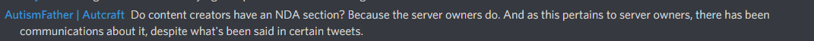

We should take a moment to notice how Microsoft is keeping all of their communities separated in their discord with their own roles, channels, and NDAs. We'll come back to that in a minute.

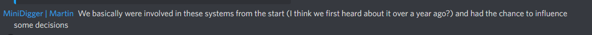

It doesn't seem as if each group has the same NDA, however.

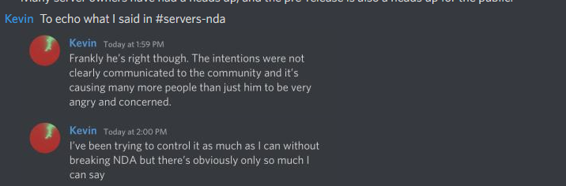

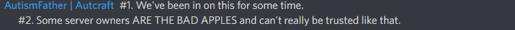

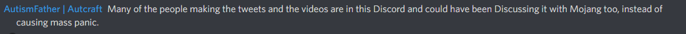

But, it doesn't seem clear how content creators were causing *"mass panic"*. They did not have access to all of the information at the time, and have a right to highlight concerns with this.

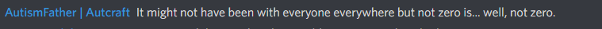

There are over 750,000 servers, and a very, **very** tiny fraction of them were allowed to give feedback on this change before the rest of us. Communities were not properly represented.

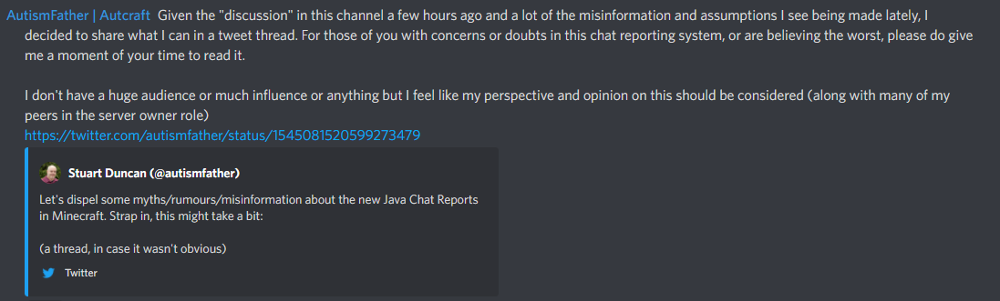

Leaving out the fact you are under NDA and in communication with Mojang is a conflict of interest, and makes all these tweets extremely biased. We also argue it goes against the core idea of dispelling misinformation. 

Let's up the stakes on that.

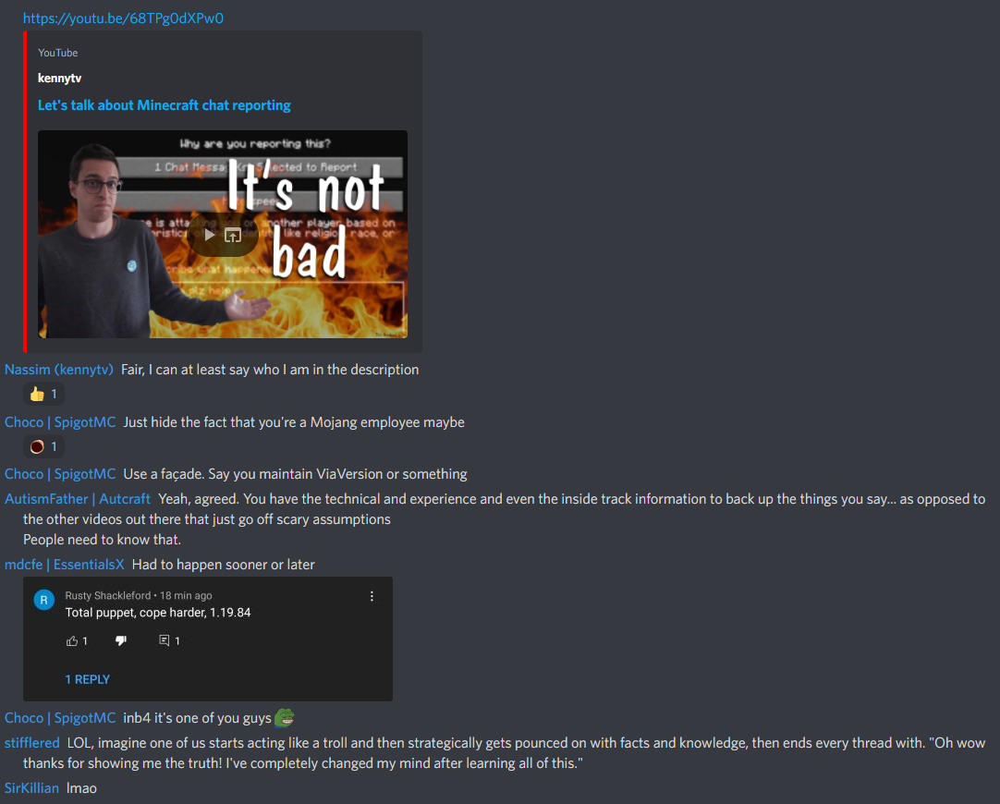

And of course, let's check the YouTube Comments. *(We caught this happening live!)*

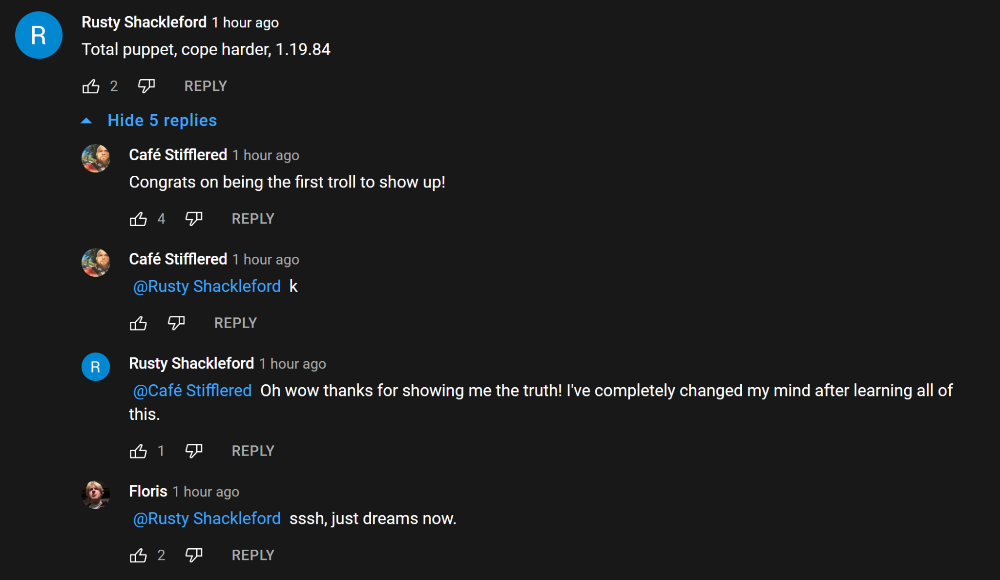

It seems like Mojang chose to have a small select group of server owners included in the process since **before** migration, **actively** keeping the majority of players in the shadows, and even going as far as having people involved under NDAs. It's extremely clear to us that these people formed an *"echo chamber"*. Some of these people actively spread misinformation themselves, staged comments, and even gaslighted all opposition as misinformation, confusion, clickbait and fearmongering. These are all unacceptable to us and should be unacceptable for Mojang.

The overall community reaction to chat reporting should make it pretty clear these people under the NDAs only represent a small part of the community. We're convinced that if Mojang chose to be open and upfront about these changes, there wouldn't have been nearly as much pushback from the community. 

Now, let's talk about how Mojang chose to treat their content creators that aren't under NDAs, and had absolutely no clue that mojang was communicating on a different playing field. 

There was absolutely zero prior communication to any of these content creators. In fact, only hours before chat reporting was first released Mojang held the creator summit. We don't think leaving out chat reporting in the creator summit can be called an accident or miscommunication at all. 

This is a channel in the same discord which is locked under the creator role, as far as we know.

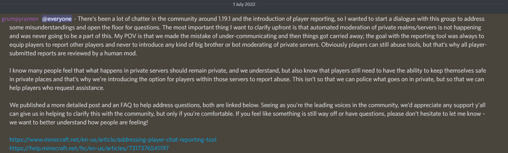

After almost two weeks of radio silence, this was the first time anyone from Mojang approached their content creators. Nothing was ever posted regarding chat reporting in any of the other channels for smaller creators etc, only in this specific channel, continuing their select feedback process, but that will fall apart here in the next picture. 
There was an overwhelming amount of *"contra"* chat reporting feedback, concerns and fears by almost all of Minecraft content creation, in complete contrast to the lounges channel. Most questions and concerns were answered with shallow excuses and corporate talk tactics, avoiding the actual issues followed by another two weeks of complete silence. 

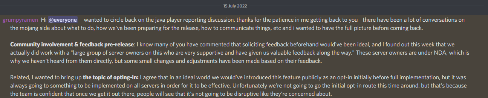

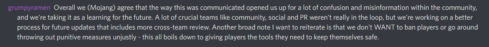

Server owners on the other hand get bi-weekly meetings with Mojang.

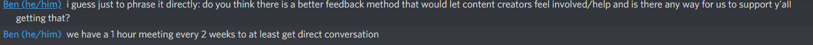

Two weeks later, Mojang returns with this info *(which at that point we had for weeks looking simply at the lounge's chat)*, basically letting them know all the feedback they gave never mattered. 

We'd also like to point out what Mojang's mental gymnastics.
1. It's extremely clear it wasn't a large group of owners, and was most likely was a small group of large server owners and mostly server software developers. 
2. There really hasn't been any underlying issues in communications between teams, considering over one year ago decisions were made to keep the feedback loop under NDAs and away from the public. Those decisions have been continued even after release of the system. 
3. This situation was created by Mojang with full intent to keep it that way as long as twelve months ago. 
4. Mojang to this day has chosen to keep the community mostly uninformed about all this and still tries to keep it that way. 
5. Mojang keeps their different communities as separated as possible and only interacts with the ones they deem necessary to be worked on.

*This document is linked here: https://saveminecraft.org/leaks .*

*This document has been [backed up](https://rentry.co/internal-mojang-leaks).*

*Based off of the anonymous leak found [here](https://anonfiles.com/2cb4dc25yc/InternalMojangLeak_pdf).*